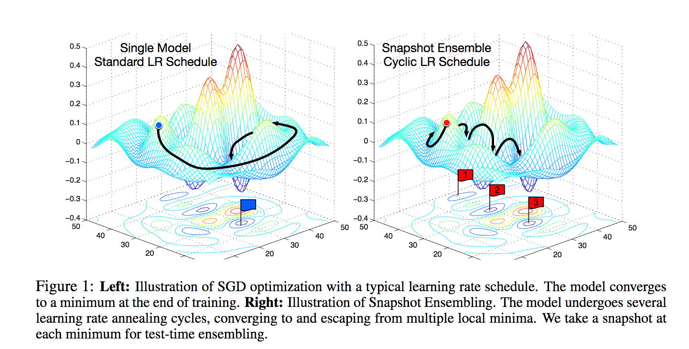

# Snapshot Ensembles

This repository contains an implementation in Keras of the paper [Snapshot Ensembles: Train 1, get M for free](https://arxiv.org/abs/1704.00109).

The authors use a modified version of cyclical learning rate to force the model
to *fall* into local minima at the end of each cycle. Each local minima makes different mistakes. Thus the ensemble of every local minima helps to reach a better generalization.




# Prototype

This is a callback:

```python
Snapshot(folder_path, nb_epochs, nb_cycles=5, verbose=0)
```

With:

- `folder_path`: The folder path where every cycle weights will be stored. If the folder does not exist, it will be created.
- `nb_epochs`: The total number of epoch. Necessary to compute the learning rate modifier formula.
- `nb_cycles`: The number of cycles, must be inferior to the number of epochs.
- `verbose`: If verbose is greater than 0, messages will be printed when the learning rate is modified or a cycle has been saved.

# Usage

```python
from snapshot import Snapshot

callback = Snapshot('snapshots', nb_epochs=6, verbose=1, nb_cycles=2)
model.fit(
    x=x_train, y=y_train,
    epochs=10,
    batch_size=32,
    callbacks=[callback]
)
```

The authors advise to use the mean of the models'outputs. The file `example.py` shows how one could do it.
